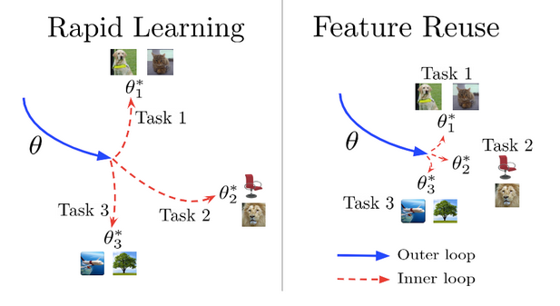
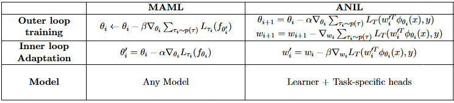
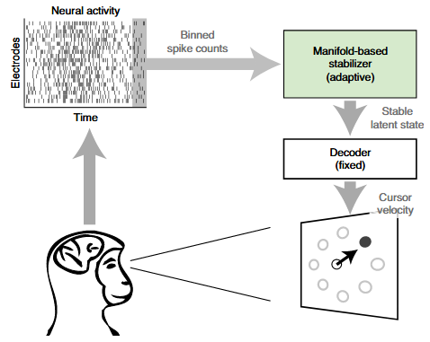
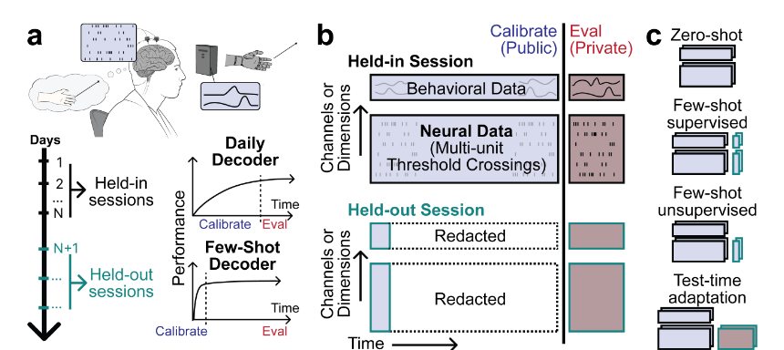
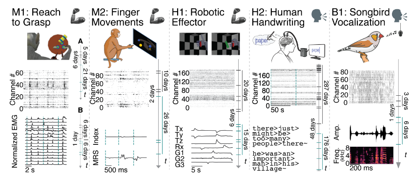
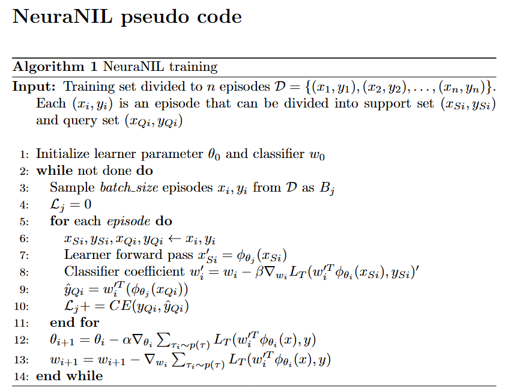

# NeuraNIL

CSCI1470 Final Project

## Team members

Carlos Ramos: carlos_ramos@brown.edu  
Jania Vandevoorde: jania_vandevoorde@brown.edu  
Yishu Li: yishu_li@brown.edu

CS Logins: jvandevo, cramos6, yli626

## Introduction

Intracortical brain-computer interfaces (iBCIs) hold significant promise for restoring communication and motor functions in patients with conditions such as ALS, stroke, spinal cord injury, etc. However, the instability of neural signals across days remains one of the greatest challenges to achieving long-term stable neural decoding. This project proposes the use of the meta-learning approach, ANIL (Almost No Inner Loop), to enable rapid adaptation to the daily variations in neural signals, enhancing the reliability of neural decoding systems.  
Furthermore, considering the few-shot learning capabilities of meta-learning, this approach is well-suited for adapting to novel motor imagery types that are not present during the initial training phase.

## Related Works

1. **Model agnostic meta-learning:**  
In 2017, Finn et al. proposed a model agnostic meta-learning method (**MAML**) that enable a model trained on a variety of learning tasks, such that it can solve new learning tasks using only a small number of training samples. They achieved this goal by training the model to make it easy to be generalized with only a small number of gradient steps and a small amount of training data from a new tasks. This method is compatible with any model trained with gradient descent.  
The training process is divided to two types of parameter updates: *the outer loop* and *inner loop*. The outer loop updates the meta-initialization of the neural network parameters to a setting that enables fast adaptation to new tasks. The inner loop takes the outer loop initialization and performs task-specific adaptation over a few labeled samples.
In 2019, Raghu et al. conjectured that we can obtain the same rapid learning performance of MAML solely through feature reuse by only update the last layer of the model during the inner loop. To test this hypothesis, they introduced **ANIL** (almost no inner loop), a simplified algorithm of MAML that is equally effective but computationally faster.

2. **Deep learning, non-linearity, and neural decoding:**  
Linear decoders such as Kalman filter have widely used for neural decoding to enable individuals with paralysis to control computer cursor. However, further advances are needed to deliver better performance. Pervious researches showed that deep learning methods such as multi-layers perceptron and recurrent neural networks can provide higher performance by inducing non-linearity into the decoders.  
The problem with deep learning is that training a deep learning model requires much more data than training a simple non-linear decoders. Deep learning models are usually harder to update and adapt to new data.

3. **Neural non-stationary and manifold-based iBCI decoders:**  
Many pervious researches have shown the non-stationary of neural signals, models trained on pervious days may suffer from performance degradation or even break after several weeks or even days. Many methods have been proposed to address this problem, and one of the most used methods is manifold-based decoders. The manifold-based decoders first map the neural data to a lower dimensional latent space, and algin the latent space neural data to the initial distribution where the decoder was first trained, and then decoder from the aligned lower dimensional data to eliminate the non-stationary and maintain the decoder performance across days.

## Data (TBD)

In this project, we are going to use two datasets. The first one is the FALCON dataset addressing evaluating the iBCI decoder performance across days. The second one will be the neural data recorded from a BrainGate2 clinical trial participant with advanced ALS and implanted Utah array when the participant trying to perform multiple gesture imagery to communicate.  
As a meta-learning project, the data will be divided to episodes. Each episode contain a support set and query set, the support set data will be used to update the inner loop while the query data will be used to calculate the loss and update the model.

1. **FALCON dataset:** The FALCON dataset is consist of 5 datasets including neural data recorded form humans, non-human primates and birds. The H2 dataset is a classification task where a human participant imagining writing. The decoder will need to decode the character the participant is trying to write. The dataset is divided two three parts: Held-in, Held-out, and and Minival. The Held-in and Minival set are from the training period where the model should be trained and validated and the Held-out set is from the first several blocks in each day from testing period where the model can be fast recelebrated for that day.  

 

2. **BrainGate2 clinical trial data:** The BrainGate2 clinical trial data we are going to use is from a ongoing clinical trial where a BrainGate2 participant with advanced ALS trying to communicate by imagining a set of gestures. The raw signal was recorded as 30000 Hz voltage data, then preprocessing including re-reference, filtering, threshold crossing, and power calculation will be calculated to get binned spiking rate and spiking power features.

## Methodology

### Model Structure

The model will be consist of two parts: outer loop (learner) and inner loop (classifier). The learner will be fixed after trained on the training data, and the classifier will be updated on each day with *K* step gradient descent.

**Learner:** To best address the temporal neural data, the learner will be a LSTM model or Transformer model, which takes in the raw neural feature and map the neural data into a lower dimensional latent space.

**Classifier:** The classifier takes the latent space neural data and predict the label of the data, it can be a MLP or some simple machine learning algorithms such as KNN, GNB or LDA.  

### Training

As mentioned before, each episode data is divided to support set and query set. When training, the learner will first perform the forward pass for support set to get the support set latent space data point, and use the support set latent space data points and support set labels to fit the classifier. Then the forward pass will be performed on query set through both the learner and the fitted classifier to calculate a loss, and this loss will be used to update the parameters in the learner. After the training, we will fix the learner, and refit the classifier on each new days or new tasks.

### Backup Plan (TBD)

## Metrics

This is a classification project, so the main metrics will be classification accuracy.

- **Base:** For the BrainGate2 data, there are Gaussian Naive Bayes decoder decoded accuracy where the GNB model is trained from scratch everyday. The base goal for this dataset will be to have a similar accuracy compared with the GNB decoder. For the FALCON dataset, the base goal should be approach the example model performance on FALCON project.

- **Target:** Reach higher accuracy than the given baseline mentioned in "Base". Also, try if smaller recalibration set can be used in BrainGate2 data.

## Ethics 

- Why is Deep Learning a good approach to this problem?  
As mentioned in the previous section, compared with the linear methods being widely used in the iBCI area, deep learning introduced non-linearity to the model, which is more similar to how brain encode the signal. Therefore, deep learning can give better performance in neural decoding tasks. However, there are still concerns about the lack of interpretability of deep learning and the question who should be to blame when the algorithm makes mistakes. Some of the mistake could be serious because some of the patient like ALS patients may have rely on the iBCI to communicate due to their medical condition. From my point of view, in this field, the most urgent thing is still to create a usable and reliable system for the people in need, so we should first leverage the high performance of deep learning and then try to solve the corresponding problems.

- Who are the major “stakeholders” in this problem, and what are the consequences of mistakes made by your algorithm?  
The major "stakeholders" in this problem are the people who lost their ability to move or even communicate such as patient with paralysis or ALS. For a patient with late-stage ALS, iBCI decoder could be his or her only method to communicate either in their daily life or even for medical communication. Therefore, a unreliable decoder could cause really serious problems. Further more, for restoring motor function, if a patient with paralysis is trying to use wheel chair through a iBCI system alone, a decoding mistake may also cause dangerous problems such as making the person fall.  

## Division of labor (TBD)